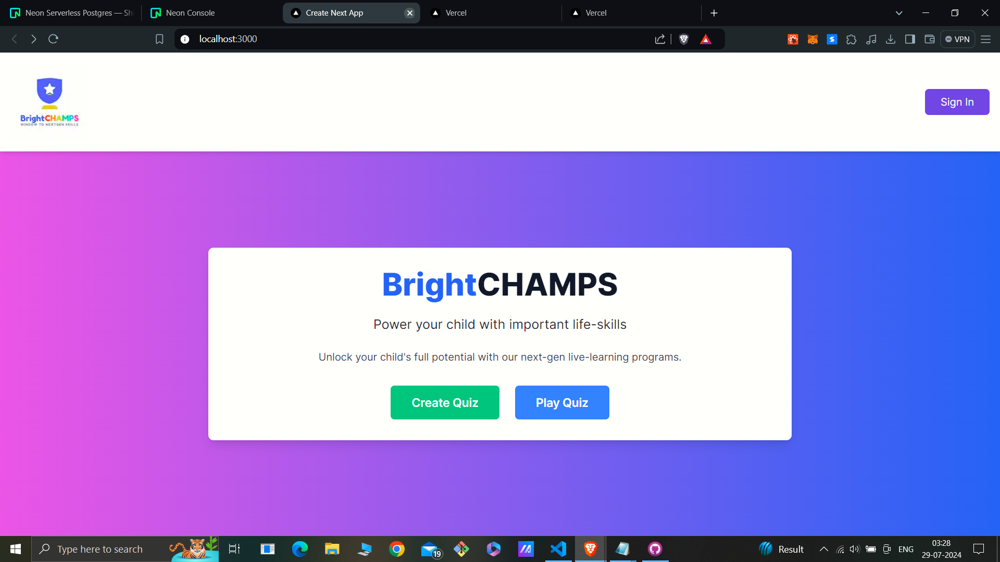

<<<<<<< HEAD

# Quiz Application



# 

# Quiz Application


> > > > > > > efcd930dee37d6114e117b00cb2d39c83d71d1b3

This project is a Quiz Application built with Next.js, React, and TypeScript. It allows users to create quizzes, take quizzes with a countdown timer, and view their results.

## Features

- Create quizzes with multiple-choice questions.
- Take quizzes with a countdown timer.
- Submit quizzes and view results.
- Responsive design with Tailwind CSS.

## Technologies Used

- Next.js
- React
- TypeScript
- Tailwind CSS for styling
- Axios for API requests
- postgreSQL
- Prisma

## Getting Started

### Prerequisites

Ensure you have the following installed on your machine:

- Node.js (>=14.x)
- npm or yarn
- A PostgreSQL database (or another Prisma-supported database)

### Installation

1. Clone the repository:

   ```sh
   git clone https://github.com/yourusername/quiz-app.git
   cd quiz-app

   ```

   =======

   > > > > > > > efcd930dee37d6114e117b00cb2d39c83d71d1b3

## Quiz App with Next.js, Tailwind CSS, and Axios

**Installation:**

1. Open your terminal in the project directory.
2. Run `npm install` (or `yarn install`) to install dependencies.

**Environment Variables:**

Create a file named `.env.local` in your project root and add the following variables, replacing the placeholders with your actual values:

NEXTAUTH_URL=http://localhost:3000
NEXTAUTH_SECRET=your-nextauth-secret
GOOGLE_ID=your-google-id
GOOGLE_SECRET=your-google-secret
NEXT_PUBLIC_OPENAI_KEY=your-openai-key

<<<<<<< HEAD

1. Open your terminal in the project directory.
2. Run `npm install` (or `yarn install`) to install dependencies.

=======

1. Open your terminal in the project directory.
2. Run `npm install` (or `yarn install`) to install dependencies.

> > > > > > > efcd930dee37d6114e117b00cb2d39c83d71d1b3
> > > > > > > Development Server:

**Development Server:**

Start the development server with:

- # `npm run dev` (or `yarn dev`)

* `npm run dev` (or `yarn dev`)

The application will be available at http://localhost:3000.

**Features:**

<<<<<<< HEAD

- **Create Quiz:** Define quiz details and questions.
- **Take Quiz:** Answer questions within a timer limit.
- **Timer:** Tracks remaining time during the quiz.
- **Results:** View your score and correct answers after submission.

**API Routes:**

- `POST /api/Seeparticularquiz`: Retrieve quiz details by ID.
- `POST /api/submitQuiz`: Submit answers and receive score & correct answers.

**Components:**

- `CreateQuiz`: Form for creating a new quiz.
- `TakeQuiz`: Interface for taking a quiz.
- `Timer`: Manages the quiz countdown.

**Pages:**

- `Page.tsx`: Home page.
- `create-quiz.tsx`: Page for creating a quiz.
- `Seequiz.tsx`: Page for taking a quiz.
- # `results.tsx`: Page for viewing quiz results.

* **Create Quiz:** Define quiz details and questions.
* **Take Quiz:** Answer questions within a timer limit.
* **Timer:** Tracks remaining time during the quiz.
* **Results:** View your score and correct answers after submission.

**API Routes:**

- `POST /api/Seeparticularquiz`: Retrieve quiz details by ID.
- `POST /api/submitQuiz`: Submit answers and receive score & correct answers.

**Components:**

- `CreateQuiz`: Form for creating a new quiz.
- `TakeQuiz`: Interface for taking a quiz.
- `Timer`: Manages the quiz countdown.

**Pages:**

- `Page.tsx`: Home page.
- `create-quiz.tsx`: Page for creating a quiz.
- `Seequiz.tsx`: Page for taking a quiz.
- `results.tsx`: Page for viewing quiz results.

**Styling:**

Tailwind CSS is used for styling the components.

**Contributing:**

1. Fork the repository.
2. Create a new branch for your changes.
3. Make your contributions and commit them with descriptive messages.
4. Push your branch to the remote repository.
5. Submit a pull request for review and merging.

**Acknowledgements:**

- Next.js
- Tailwind CSS
- Axios
- TypeScript

**Additional Notes:**

- Replace `your-nextauth-secret`, `your-google-id`, `your-google-secret`, and `your-openai-key` with your actual values.
- # The `NEXT_PUBLIC_OPENAI_KEY` is optional and might be used for additional features not covered in this overview.

**Acknowledgements:**

- Next.js
- Tailwind CSS
- Axios
- TypeScript
